<div align="center">


# 🚦 Road Safety Expert System

### *AI-Powered Road Safety Intervention Recommendations*

<p align="center">
  
  
  
  
</p>

<p align="center">
  
  
  
  
</p>

<h3>
  <a href="#-features">Features</a> •
  <a href="#-quick-start">Quick Start</a> •
  <a href="#-demo">Demo</a> •
  <a href="#-contributing">Contributing</a>
</h3>

<p align="center">
  <i>Describe a road safety issue in natural language and receive expert recommendations<br/>based on official guidelines, powered by Google Gemini AI.</i>
</p>


</div>

<br/>

## 🌟 Features

<table>
<tr>
<td width="50%">

### 🤖 AI-Powered Analysis
Leverages **Google Gemini 2.0 Flash** for intelligent, context-aware recommendations based on your natural language input.

</td>
<td width="50%">

### 📊 Official Guidelines
All recommendations are backed by a curated database of **verified road safety interventions** with official codes and clauses.

</td>
</tr>
<tr>
<td width="50%">

### 🔗 Easy Sharing
Generate **unique shareable links** and **QR codes** for reports. Share via email, WhatsApp, or any platform!

</td>


<td width="50%">

### ⚡ Lightning Fast
**<4 second** response times with serverless architecture. Available **24/7** with **98% accuracy**.

</td>
</tr>
<tr>
<td width="50%">

### 📱 Fully Responsive
Beautiful, modern UI that works seamlessly on **desktop, tablet, and mobile** devices.

</td>
</tr>
</table>

<br/>

## 🎯 How It Works

```mermaid
graph LR
    A[👤 User Input] -->|Natural Language| B[🔍 Keyword Analysis]
    B --> C[📚 Database Search]
    C --> D[🤖 AI Processing]
    D --> E[📊 Generate Report]
    E --> F[✅ Display Results]
    F --> G[🔗 Share/Export]
    
    style A fill:#e1f5ff
    style D fill:#fff3e0
    style F fill:#e8f5e9
    style G fill:#f3e5f5
```

<div align="center">



</div>

<div align="center">

| Step | Description |
|:----:|-------------|
| **1️⃣** | **Describe** the road safety issue in your own words |
| **2️⃣** | **AI analyzes** and searches the intervention database |
| **3️⃣** | **Receive** detailed, guideline-based recommendations |
| **4️⃣** | **Share** via link/QR code or download as PDF |

</div>

<br/>

## 🚀 Quick Start

<div align="center">

### Get up and running in 3 minutes! ⏱️

</div>

### 📦 Prerequisites

```bash
Node.js 18.x or higher
npm 
Google Gemini API Key (Get one free at https://aistudio.google.com/app/api-keys)
```

### 🔧 Installation

```bash
# 1️⃣ Clone the repository
git clone https://github.com/puneet-chandna/Road-Safety-GPT

# 2️⃣ Navigate to frontend directory
cd Road-Safety-GPT/frontend

# 3️⃣ Install dependencies
npm install

# 4️⃣ Set up environment variables
cp .env.example .env
# Edit .env and add your GEMINI_API_KEY

# 5️⃣ Start development servers
npm run dev
```

<div align="center">

### 🎉 That's it! Open http://localhost:5173

</div>

<br/>


## 🎥 Demo Video

[](https://drive.google.com/file/d/1Y-rHEGRNNdJC4jS4o9WPJmk4zbg9RZqk/view?usp=sharing)


<br/>

## 🏗️ Project Structure

```
road-safety-expert-system/
│
├── 📁 frontend/                          # Main application
│   │
│   ├── 📁 api/                          # Vercel Serverless Functions
│   │   └── generate-report.js           # AI report generation endpoint
│   │
│   ├── 📁 src/                          # React Application
│   │   ├── 📁 components/
│   │   │   ├── Header.jsx              # App header
│   │   │   ├── InputForm.jsx           # User input form
│   │   │   ├── ReportCard.jsx          # Report display
│   │   │   ├── ReportPage.jsx          # Shareable report page
│   │   │   ├── LoadingSkeleton.jsx     # Loading state
│   │   │   ├── ShareModal.jsx          # Share functionality
│   │   │   └── Intro.jsx               # Landing page
│   │   │
│   │   ├── App.jsx                     # Main component
│   │   ├── main.jsx                    # Entry point
│   │   └── index.css                   # Global styles
│   │
│   ├── 📁 public/                       # Static assets
│   │
│   ├── 📄 road_safety_interventions.csv # Intervention database (41KB)
│   ├── 📄 server-dev.js                # Local dev API server
│   ├── 📄 vercel.json                  # Vercel config
│   ├── 📄 vite.config.js               # Vite config
│   ├── 📄 tailwind.config.js           # Tailwind config
│   └── 📄 package.json                 # Dependencies
│
├── 📄 README.md                         # You are here!
├── 📄 CONTRIBUTING.md                   # Contribution guidelines
└── 📄 LICENSE                           # ISC License
```

<br/>

## 🛠️ Tech Stack

<div align="center">

### Frontend


### Backend & Infrastructure


### Tools & Libraries


</div>

<br/>

<table align="center">
<tr>
<th>Category</th>
<th>Technology</th>
<th>Purpose</th>
</tr>
<tr>
<td><b>Frontend</b></td>
<td>React 18.2.0</td>
<td>UI Library</td>
</tr>
<tr>
<td><b>Build Tool</b></td>
<td>Vite 5.2.0</td>
<td>Fast dev server & bundler</td>
</tr>
<tr>
<td><b>Styling</b></td>
<td>TailwindCSS 3.4.3</td>
<td>Utility-first CSS</td>
</tr>
<tr>
<td><b>Routing</b></td>
<td>React Router DOM</td>
<td>Client-side navigation</td>
</tr>
<tr>
<td><b>AI</b></td>
<td>Google Gemini 2.0</td>
<td>Natural language processing</td>
</tr>
<tr>
<td><b>Backend</b></td>
<td>Vercel Serverless</td>
<td>API endpoints</td>
</tr>
<tr>
<td><b>PDF</b></td>
<td>jsPDF + html2canvas</td>
<td>Report generation</td>
</tr>
<tr>
<td><b>QR Codes</b></td>
<td>qrcode</td>
<td>Shareable QR codes</td>
</tr>
<tr>
<td><b>Database</b></td>
<td>CSV + csv-parse</td>
<td>Intervention data</td>
</tr>
</table>

<br/>

## 💻 Development

### 🏃 Running Locally

The project uses a **dual-server approach** for optimal development:

<div align="center">

| Server | Port | Purpose |
|:------:|:----:|---------|
| **Vite** | 5173 | Frontend with hot reload |
| **Express** | 3001 | Local API endpoint |

</div>

```bash
# Start both servers simultaneously
npm run dev

# You'll see:
# 🚀 Development API server running on http://localhost:3001
# ➜  Local:   http://localhost:5173/
```

### 🔐 Environment Variables

Create `.env` in the `frontend/` directory:

```env
GEMINI_API_KEY=your_gemini_api_key_here
```

<div align="center">

**🔑 Get your free API key:** [Google AI Studio](https://aistudio.google.com/app/api-keys)

</div>

### 📜 Available Scripts

```bash
npm run dev      # Start development servers
npm run build    # Build for production
npm run preview  # Preview production build
npm run lint     # Run ESLint
```

<br/>

## 🌐 Deployment

<div align="center">

### Deploy to Vercel in 2 minutes! ⚡

[](https://vercel.com/new)

</div>

### 🚀 Quick Deploy Steps

```bash
# 1️⃣ Push to GitHub
git add .
git commit -m "Ready for deployment"
git push origin main

# 2️⃣ Import to Vercel
# Go to https://vercel.com/new
# Select your repository
# Set root directory to: frontend

# 3️⃣ Add Environment Variable
# Name: GEMINI_API_KEY
# Value: Your API key

# 4️⃣ Deploy!
# Click "Deploy" and wait ~2 minutes
```

<div align="center">

### 🎉 Your app is live!

**See detailed deployment guide:** [frontend/DEPLOYMENT.md](frontend/DEPLOYMENT.md)

</div>

<br/>

## 📊 Performance

<div align="center">

<table>
<tr>
<td align="center">
<h3>⚡</h3>
<h4>Response Time</h4>
<h2>&lt;4s</h2>
</td>
<td align="center">
<h3>🎯</h3>
<h4>Accuracy</h4>
<h2>98%</h2>
</td>
<td align="center">
<h3>🌍</h3>
<h4>Availability</h4>
<h2>24/7</h2>
</td>
<td align="center">
<h3>📱</h3>
<h4>Lighthouse</h4>
<h2>95+</h2>
</td>
</tr>
</table>

</div>

<br/>

## 🧪 Testing

### Sample Test Cases

<div align="center">

| Scenario | Input | Expected Output |
|:--------:|-------|-----------------|
| 🛑 | "STOP sign is bent and damaged" | Replacement recommendation with specs |
| 🎨 | "Road marking is barely visible" | Repainting guidelines with standards |
| 📍 | "Sign is too close to intersection" | Proper placement distance & regulations |
| 💡 | "Sign doesn't reflect at night" | Retroreflective material specifications |
| 🌳 | "Tree blocking the warning sign" | Vegetation clearance guidelines |

</div>

<br/>

## 🐛 Troubleshooting

<details>
<summary><b>❌ "Failed to get a response from the server"</b></summary>

<br/>

**Solutions:**
1. Verify `.env` file exists with valid `GEMINI_API_KEY`
2. Check both servers are running (you should see 2 startup messages)
3. Restart: `Ctrl+C` then `npm run dev`

</details>

<details>
<summary><b>❌ 404 on shared report links (Vercel)</b></summary>

<br/>

**Solutions:**
1. Verify `vercel.json` has client-side routing config
2. Redeploy the application
3. Clear browser cache or test in incognito

</details>

<details>
<summary><b>❌ API not working in production</b></summary>

<br/>

**Solutions:**
1. Check `GEMINI_API_KEY` is set in Vercel environment variables
2. View Vercel function logs for errors
3. Verify `api/generate-report.js` exists

</details>

<details>
<summary><b>❌ Port 3001 already in use</b></summary>

<br/>

**Solution:**
```bash
# Kill the process using port 3001
kill -9 $(lsof -ti:3001)

# Restart
npm run dev
```

</details>

<br/>


## 🤝 Contributing

<div align="center">

**We love contributions!** 💙

Whether it's bug fixes, new features, or documentation improvements,<br/>
all contributions are welcome and appreciated.

</div>

### How to Contribute

1. **Fork** the repository
2. **Create** a feature branch (`git checkout -b feature/amazing-feature`)
3. **Commit** your changes (`git commit -m 'Add amazing feature'`)
4. **Push** to the branch (`git push origin feature/amazing-feature`)
5. **Open** a Pull Request

<div align="center">

**Read our [Contributing Guidelines](CONTRIBUTING.md) for more details**

</div>

<br/>

## 🌟 Show Your Support

<div align="center">

If this project helped you, please consider giving it a ⭐!

<a href="https://github.com/puneet-chandna/Road-Safety-GPT/stargazers">
  
</a>

</div>

<br/>

## 📄 License

<div align="center">

This project is licensed under the **ISC License**

See [LICENSE](LICENSE) file for details

</div>

<br/>

## 🙏 Acknowledgments

<div align="center">

<table>
<tr>
<td align="center">

<br/>
<b>Google Gemini</b>
<br/>
<sub>AI Power</sub>
</td>
<td align="center">

<br/>
<b>Vercel</b>
<br/>
<sub>Hosting</sub>
</td>
<td align="center">

<br/>
<b>React</b>
<br/>
<sub>UI Library</sub>
</td>
<td align="center">

<br/>
<b>Vite</b>
<br/>
<sub>Build Tool</sub>
</td>
<td align="center">

<br/>
<b>Tailwind</b>
<br/>
<sub>Styling</sub>
</td>
</tr>
</table>

</div>

<br/>

## 📞 Contact & Support

<div align="center">

<table>
<tr>
<td align="center">
<a href="https://github.com/puneet-chandna/Road-Safety-GPT/issues">

<br/>
<b>Report Bug</b>
</a>
</td>
<td align="center">
<a href="https://github.com/puneet-chandna/Road-Safety-GPT/issues">

<br/>
<b>Request Feature</b>
</a>
</td>
<td align="center">
<a href="https://github.com/puneet-chandna/Road-Safety-GPT/discussions">

<br/>
<b>Discussions</b>
</a>
</td>
</tr>
</table>

</div>

<br/>

---

<div align="center">


<br/>

### Made with ❤️ for Safer Roads

<br/>


<br/>

**[⬆ Back to Top](#-road-safety-expert-system)**

<br/>

<sub>Built with React • Powered by AI • Deployed on Vercel</sub>

</div>
